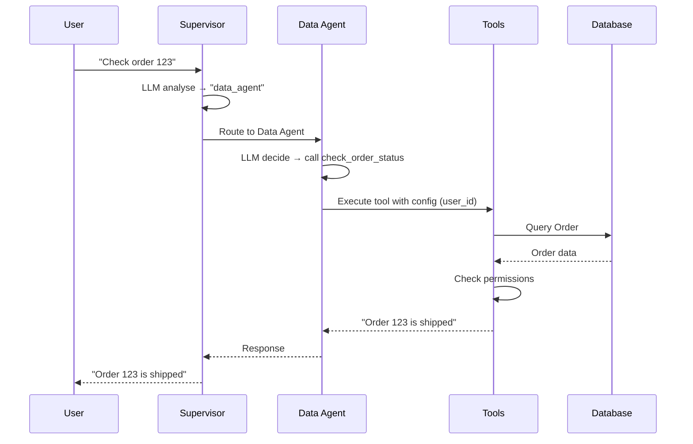

# 🏗️ Architecture Finale - Multi-Agent System

**Date**: 9 janvier 2026  
**Version**: V2 (Production Ready)  
**Status**: ✅ **STABLE**

---

## 📊 Vue d'Ensemble

Notre système multi-agents utilise les **bibliothèques officielles LangChain/LangGraph** pour une solution robuste, maintenable et scalable.

```
┌─────────────────────────────────────────────────────────────┐
│                         User Request                         │
└────────────────────────────┬────────────────────────────────┘
                             │
                             ▼
                   ┌──────────────────┐
                   │   Supervisor     │ ← langgraph_supervisor
                   │   (LLM-based)    │    (Bibliothèque officielle)
                   └────────┬─────────┘
                            │
           ┌────────────────┼────────────────┐
           │                │                │
           ▼                ▼                ▼
    ┌──────────┐     ┌──────────┐    ┌──────────┐
    │   Data   │     │ Support  │    │ Document │
    │  Agent   │     │  Agent   │    │  Agent   │
    └──────────┘     └──────────┘    └──────────┘
         │                 │                │
         ▼                 ▼                ▼
    [Tools]           [No Tools]       [Tools]
    - Orders          - Chat           - CRUD Docs
    - Tickets
```

---

## 🎯 Composants Principaux

### 1. **Supervisor** (`ai/graph.py`)
```python
from langgraph_supervisor import create_supervisor

supervisor = create_supervisor(
    agents=get_all_agents(),
    model=get_llm("decision_agent"),
    prompt="You manage specialized agents..."
)
```

**Responsabilité** : Routing intelligent basé sur LLM
**Bibliothèque** : `langgraph-supervisor` (officielle)

---

### 2. **Agents** (`ai/agents.py`)
```python
from langchain.agents import create_agent

agent = create_agent(
    model=llm,
    tools=tools,
    prompt="You are...",
    checkpointer=checkpointer,
    name="agent_name"
)
```

**Responsabilité** : Exécuter des tâches spécialisées
**Bibliothèque** : `langchain.agents` (officielle, ex `langgraph.prebuilt`)

#### Agents Disponibles :

| Agent | Description | Tools |
|-------|-------------|-------|
| **data_agent** | Récupère des données (orders, tickets) | ✅ `check_order_status`, `get_ticket_info` |
| **support_agent** | Support généraliste (chat) | ❌ Pas de tools |
| **document_agent** | Gestion de documents (CRUD) | ✅ 6 tools (search, list, get, create, update, delete) |

---

### 3. **Tools** (`ai/tools/`)
```
ai/tools/
├── order_tools.py      → check_order_status
├── ticket_tools.py     → get_ticket_info
├── support_tools.py    → create_support_response
└── document_tools.py   → search, list, get, create, update, delete
```

**Responsabilité** : Exécuter des actions sur les données
**Pattern** : Tous les tools acceptent `RunnableConfig` pour le contexte utilisateur

---

### 4. **Permissions** (`ai/permissions.py`)
```python
def check_permission(user_id: int, action: str, resource: str) -> bool:
    # Orders/Tickets: read-only pour users réguliers
    # Documents: Full CRUD pour users réguliers (leurs docs)
    # Staff: All permissions
```

**Responsabilité** : Vérifier les permissions avant l'accès aux données
**Future** : Intégration avec permit.io ou django-guardian

---

### 5. **LLM Factory** (`ai/llms.py`)
```python
def get_llm_for_agent(agent):
    if agent.llm_provider == "openai":
        return ChatOpenAI(...)
    elif agent.llm_provider == "anthropic":
        return ChatAnthropic(...)
```

**Responsabilité** : Centraliser la configuration des LLMs
**Support** : OpenAI, Anthropic, Local (Ollama)

---

## 🔄 Flow d'Exécution

### Exemple : "Check order 123"



---

## 📦 Stack Technologique

### Bibliothèques Officielles ✅
- **`langgraph-supervisor`** (v0.0.31) - Supervision multi-agents
- **`langchain.agents`** - Création d'agents (ex `langgraph.prebuilt`)
- **`langgraph`** - Orchestration de graphs
- **`langchain-openai`** - LLM OpenAI
- **`langchain-anthropic`** - LLM Anthropic

### Framework
- **Django** - Backend
- **PostgreSQL** / SQLite - Base de données

---

## 🎯 Avantages de Cette Architecture

| Avantage | Description |
|----------|-------------|
| ✅ **Officiellement supporté** | Utilise les bibliothèques officielles LangChain |
| ✅ **Moins de code** | ~300 lignes vs ~1000+ avec implémentation manuelle |
| ✅ **Mises à jour automatiques** | Profite des améliorations de LangChain |
| ✅ **Scalable** | Facile d'ajouter des agents |
| ✅ **Modulaire** | Tools séparés par domaine |
| ✅ **Sécurisé** | Permissions intégrées |
| ✅ **Contexte utilisateur** | RunnableConfig propagé partout |

---

## 🚀 Comment Utiliser

### 1. Ajouter un Nouvel Agent

```python
# 1. Créer la fonction dans ai/agents.py
def create_analytics_agent(checkpointer=None):
    llm = get_llm("analytics_agent")
    tools = load_tools_for_agent("analytics_agent")
    
    agent = create_agent(
        model=llm,
        tools=tools,
        prompt="You are an analytics agent...",
        checkpointer=checkpointer or MemorySaver(),
        name="analytics_agent"
    )
    return agent

# 2. Ajouter dans get_all_agents()
def get_all_agents(checkpointer=None):
    return [
        create_data_agent(checkpointer),
        create_support_agent(checkpointer),
        create_document_agent(checkpointer),
        create_analytics_agent(checkpointer),  # ← Nouveau
    ]

# 3. Le supervisor le découvrira automatiquement !
```

### 2. Ajouter un Nouveau Tool

```python
# 1. Créer ai/tools/analytics_tools.py
from langchain_core.tools import tool
from langchain_core.runnables import RunnableConfig

@tool
def get_sales_report(period: str, config: RunnableConfig = None) -> str:
    """Generate a sales report for a given period."""
    user_id = config.get("configurable", {}).get("user_id") if config else None
    # Votre logique...
    return "Sales report..."

analytics_tools = [get_sales_report]

# 2. Ajouter dans seed_agents.py
{
    "key": "get_sales_report",
    "name": "Get Sales Report",
    "description": "Generate sales reports",
    "python_path": "ai.tools.analytics_tools.get_sales_report"
}
```

---

## 📝 Configuration Database

### Agents (`ai.models.Agent`)
```python
Agent.objects.create(
    key="data_agent",
    name="Data Agent",
    llm_provider="openai",
    llm_model="gpt-4o",
    temperature=0.0,
    system_prompt="..."
)
```

### Tools (`ai.models.Tool`)
```python
Tool.objects.create(
    key="check_order_status",
    name="Check Order Status",
    python_path="ai.tools.order_tools.check_order_status"
)
```

### Permissions (`ai.models.AgentTool`)
```python
AgentTool.objects.create(
    agent=data_agent,
    tool=check_order_tool,
    allowed=True
)
```

---

## 🧪 Tests

### Test Unitaire
```bash
python manage.py test ai
```

### Test Manuel (Django Shell)
```python
from ai.graph import build_graph
from langchain_core.messages import HumanMessage

graph = build_graph()
result = graph.invoke({
    "messages": [HumanMessage(content="Check order 123")]
}, config={"configurable": {"thread_id": "test", "user_id": 1}})

print(result["messages"][-1].content)
```

### Test API
```bash
curl -X POST http://localhost:8000/ai/trigger/ \
  -H "Content-Type: application/json" \
  -d '{"message": "Check order 123"}'
```

---

## 📚 Documentation

- **Architecture** : `ai/docs/FINAL_ARCHITECTURE.md` (ce fichier)
- **Supervisor Pattern** : `ai/docs/SUPERVISOR_PATTERN.md`
- **Document Tools** : `ai/docs/DOCUMENT_TOOLS.md`
- **Migration V1→V2** : `ai/docs/V1_VS_V2_COMPARISON.md`

---

## 🔍 Dépannage

### Import Warning
Si vous voyez :
```
create_react_agent has been moved to langchain.agents
```

**Solution** : Utiliser `from langchain.agents import create_agent`

### Tool Not Found
Si un tool n'est pas trouvé :
1. Vérifier que le tool existe dans `ai/tools/`
2. Vérifier `Tool.python_path` dans la DB
3. Vérifier `AgentTool` link entre agent et tool

### Permission Denied
Si permission denied :
1. Vérifier `check_permission()` dans `ai/permissions.py`
2. Vérifier que `user_id` est passé dans `config`
3. Vérifier que l'utilisateur est staff ou owner

---

## ✅ Status

- ✅ Architecture V2 stable
- ✅ Bibliothèques officielles utilisées
- ✅ 3 agents opérationnels
- ✅ 9 tools disponibles
- ✅ Permissions intégrées
- ✅ Context utilisateur propagé
- ✅ Documentation complète

**Architecture Status: ✅ PRODUCTION READY**
