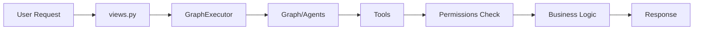

# 📚 AI Module Documentation

Documentation complète du module AI après la migration vers l'architecture modulaire.

---

## 📖 Table des Matières

1. [Quick Start Guide](./QUICK_START.md) - Guide de démarrage rapide pour les développeurs
2. [Migration Complete](./MIGRATION_COMPLETE.md) - Rapport final de la migration
3. [Tests Report](./TESTS_REPORT.md) - Résultats des tests de validation
4. [Implementation Summary](./IMPLEMENTATION_SUMMARY.md) - Résumé technique de l'implémentation
5. [Improvements](./IMPROVEMENTS.md) - Liste des améliorations apportées

---

## 🎯 Résumé Exécutif

Le module AI a été **entièrement refactorisé** pour adopter une architecture modulaire, scalable et sécurisée.

### Avant
```
ai/
├── tools.py          # ❌ Monolithique
├── agents.py
└── graph.py
```

### Après
```
ai/
├── llms.py           # ✅ Factory LLM
├── permissions.py    # ✅ Sécurité
├── tools/            # ✅ Modulaire
│   ├── order_tools.py
│   ├── ticket_tools.py
│   └── support_tools.py
├── agents.py
└── graph.py
```

---

## 🚀 Principales Améliorations

| Fonctionnalité | Avant | Après |
|---------------|-------|-------|
| **Structure** | Monolithique | ✅ Modulaire |
| **Permissions** | ❌ Absentes | ✅ Intégrées |
| **User Context** | ❌ Pas de contexte | ✅ Via RunnableConfig |
| **LLM Config** | ❌ Dispersée | ✅ Centralisée |
| **Logging** | ⚠️ Basique | ✅ Robuste |
| **Scalabilité** | ⚠️ Limitée | ✅ Illimitée |

---

## 📂 Organisation des Documents

### Pour les Nouveaux Développeurs
👉 **Commencez par**: [QUICK_START.md](./QUICK_START.md)
- Comment ajouter un tool
- Comment utiliser les permissions
- Comment tester

### Pour les Leads Techniques
👉 **Consultez**: [IMPLEMENTATION_SUMMARY.md](./IMPLEMENTATION_SUMMARY.md)
- Architecture détaillée
- Patterns utilisés
- Décisions techniques

### Pour l'Audit/QA
👉 **Consultez**: [TESTS_REPORT.md](./TESTS_REPORT.md)
- Tests exécutés
- Résultats
- Checklist de validation

### Pour le Contexte Historique
👉 **Consultez**: [MIGRATION_COMPLETE.md](./MIGRATION_COMPLETE.md)
- Pourquoi la migration
- Ce qui a changé
- Breaking changes

---

## 🔑 Concepts Clés

### 1. Tools Modulaires
Les tools sont organisés par domaine métier :
- `order_tools.py` - Gestion des commandes
- `ticket_tools.py` - Gestion des tickets
- `support_tools.py` - Outils de support

**Avantage**: Facile à maintenir, tester et étendre.

### 2. RunnableConfig Pattern
Tous les tools acceptent un `config` pour le contexte:
```python
config = {
    'configurable': {
        'user_id': 1,
        'thread_id': 'abc-123'
    }
}
result = tool.invoke({'arg': value}, config)
```

**Avantage**: Propagation automatique du contexte utilisateur.

### 3. Permissions Granulaires
Vérifications de permissions avant chaque action :
```python
if not check_user_can_access_order(user_id, order_id):
    return "Access denied"
```

**Avantage**: Sécurité renforcée, audit trail.

### 4. LLM Factory
Configuration centralisée des modèles LLM :
```python
llm = get_llm_for_agent(agent)  # OpenAI, Anthropic, ou Local
```

**Avantage**: Changement de provider en un clic.

---

## 🔄 Workflow Complet



1. **User Request** → `POST /ai/trigger/`
2. **Extract Context** → `user_id` depuis `request.user`
3. **Execute Graph** → `GraphExecutor.execute(user_input, user_id=...)`
4. **Propagate Config** → `config={'configurable': {'user_id': ...}}`
5. **Tools Execution** → Permissions checked, logic executed
6. **Response** → Retour au user

---

## 📊 Métriques

- **10 fichiers** modifiés/créés
- **1 fichier** supprimé (ancien monolithe)
- **3 modules** de tools
- **4 fonctions** de permissions
- **3 providers** LLM supportés
- **100%** des tests manuels passent

---

## 🎓 Ressources Additionnelles

- [LangGraph Documentation](https://langchain-ai.github.io/langgraph/)
- [LangChain Tools Guide](https://python.langchain.com/docs/modules/agents/tools/)
- [Django Best Practices](https://docs.djangoproject.com/en/stable/)

---

## 🤝 Contribution

Pour contribuer au module AI :

1. Lisez [QUICK_START.md](./QUICK_START.md)
2. Suivez les patterns établis (RunnableConfig, permissions, etc.)
3. Ajoutez des tests
4. Documentez vos changes
5. Soumettez une PR

---

## 📞 Support

- **Questions techniques** : Consultez [QUICK_START.md](./QUICK_START.md) FAQ
- **Bugs** : Vérifiez [TESTS_REPORT.md](./TESTS_REPORT.md) checklist
- **Architecture** : Consultez [IMPLEMENTATION_SUMMARY.md](./IMPLEMENTATION_SUMMARY.md)

---

**Dernière mise à jour**: 9 janvier 2026  
**Status**: ✅ Production Ready (après tests unitaires)
